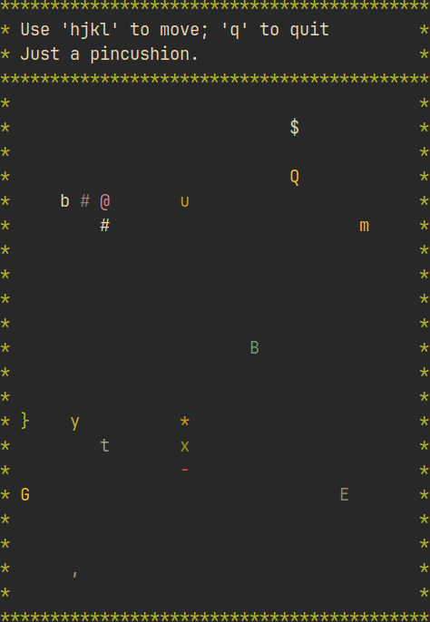

# robotfindskitten

This is an implementation of [robotfindskitten](http://robotfindskitten.org) with Rust.

In this game, you are robot (#). Your job is to find kitten. This task
is complicated by the existence of various things which are not kitten.
Robot must touch items to determine if they are kitten or not. The game
ends when robotfindskitten.

